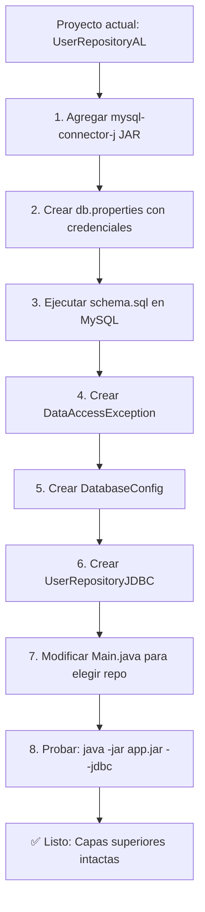

# Guía Completa de JDBC: Roadmap de Aprendizaje e Integración en Proyecto CRUD

> **Idioma**: Español Argentino  
> **Proyecto**: 06-UsuariosCRUD  
> **Arquitectura**: Capas (Model → Repository → Service → Controller → View)  
> **BD Target**: MySQL  
> **Pool**: Sin pool (DriverManager directo para learning)  
> **Excepciones**: Wrapper custom (`DataAccessException`)

---

## PARTE 1: ROADMAP DE APRENDIZAJE JDBC

### 📚 NIVEL FUNDACIONAL: Conceptos Básicos

#### 1.1 ¿Qué es JDBC?
**Java Database Connectivity (JDBC)** es la API estándar de Java para conectar y ejecutar consultas en bases de datos relacionales. Proporciona una interfaz común independiente del vendor de la BD.

#### 1.2 Componentes Principales
| Componente | Responsabilidad |
|------------|-----------------|
| `DriverManager` | Gestiona drivers JDBC y obtiene conexiones |
| `Connection` | Representa una sesión con la BD |
| `Statement` | Ejecuta SQL estático |
| `PreparedStatement` | Ejecuta SQL parametrizado (previene inyección SQL) |
| `ResultSet` | Cursor para recorrer resultados de SELECT |

#### 1.3 Flujo Básico de Conexión
```java
// 1. Cargar driver (opcional desde JDBC 4.0 / Java 6+)
Class.forName("com.mysql.cj.jdbc.Driver");

// 2. Obtener conexión
String url = "jdbc:mysql://localhost:3306/mi_bd?useSSL=false&serverTimezone=UTC";
String user = "root";
String password = "password";
Connection conn = DriverManager.getConnection(url, user, password);

// 3. Crear statement
Statement stmt = conn.createStatement();

// 4. Ejecutar query
ResultSet rs = stmt.executeQuery("SELECT * FROM users");

// 5. Procesar resultados
while (rs.next()) {
    Long id = rs.getLong("id");
    String name = rs.getString("name");
    String email = rs.getString("email");
    System.out.println(id + " - " + name + " - " + email);
}

// 6. Cerrar recursos (orden inverso a creación)
rs.close();
stmt.close();
conn.close();
```

#### 1.4 Try-with-Resources (Java 7+) - **OBLIGATORIO**
```java
try (Connection conn = DriverManager.getConnection(url, user, password);
     Statement stmt = conn.createStatement();
     ResultSet rs = stmt.executeQuery("SELECT * FROM users")) {
    
    while (rs.next()) {
        // procesar
    }
} // Cierre automático garantizado, incluso con excepciones
```

---

### 📚 NIVEL INTERMEDIO: PreparedStatement, Transacciones y Batch

#### 2.1 PreparedStatement - Prevención de SQL Injection
```java
// ❌ MALO - Vulnerable a SQL Injection
String sql = "SELECT * FROM users WHERE name = '" + name + "'";

// ✅ BUENO - Parametrizado
String sql = "SELECT * FROM users WHERE name = ?";
try (PreparedStatement ps = conn.prepareStatement(sql)) {
    ps.setString(1, name);
    ResultSet rs = ps.executeQuery();
    // ...
}
```

**Métodos principales de binding:**
| Tipo Java | Método PreparedStatement |
|-----------|--------------------------|
| String | `setString(int index, String value)` |
| Long | `setLong(int index, Long value)` |
| Integer | `setInt(int index, int value)` |
| Boolean | `setBoolean(int index, boolean value)` |
| Date | `setDate(int index, Date value)` |
| null | `setNull(int index, Types.VARCHAR)` |

#### 2.2 Transacciones: Auto-commit vs Manual

**Auto-commit (por defecto):** Cada statement es una transacción individual
```java
// Comportamiento por defecto
Connection conn = DriverManager.getConnection(url, user, password);
// conn.setAutoCommit(true); // implícito
```

**Transacciones Manuales:** Control total sobre commit/rollback
```java
Connection conn = DriverManager.getConnection(url, user, password);
conn.setAutoCommit(false);  // DESHABILITAR auto-commit

try {
    // Operación 1
    try (PreparedStatement ps1 = conn.prepareStatement(
            "INSERT INTO users (name, email) VALUES (?, ?)")) {
        ps1.setString(1, "Juan");
        ps1.setString(2, "juan@email.com");
        ps1.executeUpdate();
    }
    
    // Operación 2
    try (PreparedStatement ps2 = conn.prepareStatement(
            "INSERT INTO audit (action, user_id) VALUES (?, ?)")) {
        ps2.setString(1, "CREATE_USER");
        ps2.setLong(2, generatedId);
        ps2.executeUpdate();
    }
    
    conn.commit();  // CONFIRMAR todo
} catch (SQLException e) {
    conn.rollback();  // REVERTIR todo ante error
    throw new DataAccessException("Error en transacción", e);
} finally {
    conn.setAutoCommit(true);  // RESTAURAR default
    conn.close();
}
```

#### 2.3 Batch Processing - Inserciones Masivas
```java
String sql = "INSERT INTO users (name, email) VALUES (?, ?)";
try (PreparedStatement ps = conn.prepareStatement(sql)) {
    for (User u : users) {
        ps.setString(1, u.getName());
        ps.setString(2, u.getEmail());
        ps.addBatch();  // Agregar al lote
    }
    int[] results = ps.executeBatch();  // Ejecutar todo de una vez
}
```

---

### 📚 NIVEL AVANZADO: Patrones y Optimización

#### 3.1 Patrón DAO (Data Access Object)
Separación de lógica de acceso a datos:
- **Interface**: `UserRepository` (contrato)
- **Implementación**: `UserRepositoryJDBC` (JDBC), `UserRepositoryAL` (ArrayList)
- **Inyección**: En `Main.java` o framework DI (Spring, CDI)

#### 3.2 RowMapper - Mapeo ResultSet → Objeto
```java
@FunctionalInterface
interface RowMapper<T> {
    T mapRow(ResultSet rs, int rowNum) throws SQLException;
}

// Uso genérico
public <T> List<T> query(String sql, RowMapper<T> mapper, Object... params) {
    try (Connection conn = getConnection();
         PreparedStatement ps = conn.prepareStatement(sql)) {
        
        for (int i = 0; i < params.length; i++) {
            ps.setObject(i + 1, params[i]);
        }
        
        try (ResultSet rs = ps.executeQuery()) {
            List<T> results = new ArrayList<>();
            int rowNum = 0;
            while (rs.next()) {
                results.add(mapper.mapRow(rs, rowNum++));
            }
            return results;
        }
    }
}

// Mapeo específico para User
RowMapper<User> userMapper = (rs, rowNum) -> new User(
    rs.getLong("id"),
    rs.getString("name"),
    rs.getString("email")
);
```

#### 3.3 Metadata y DatabaseMetaData
```java
DatabaseMetaData meta = conn.getMetaData();
System.out.println("Driver: " + meta.getDriverName());
System.out.println("Versión BD: " + meta.getDatabaseProductVersion());
System.out.println("Tablas: ");
try (ResultSet tables = meta.getTables(null, null, "%", new String[]{"TABLE"})) {
    while (tables.next()) {
        System.out.println("  - " + tables.getString("TABLE_NAME"));
    }
}
```

#### 3.4 Stored Procedures
```java
// CALL sp_get_user(?, ?)
try (CallableStatement cs = conn.prepareCall("{call sp_get_user(?, ?)}")) {
    cs.setLong(1, userId);
    cs.registerOutParameter(2, Types.VARCHAR);  // OUT parameter
    cs.execute();
    String name = cs.getString(2);
}
```

---

### 📚 MEJORES PRÁCTICAS - Checklist Obligatorio

| Práctica | Por qué | Implementación |
|----------|---------|----------------|
| **Try-with-resources** | Evita leaks de conexiones | `try (Connection c = ...) { }` |
| **PreparedStatement siempre** | Previene SQL Injection | Nunca concatenar strings SQL |
| **Cerrar en orden inverso** | ResultSet → Statement → Connection | Automático con try-with-resources |
| **Connection pooling (prod)** | Performance, evita agotar conexiones | HikariCP, DBCP2, Tomcat JDBC |
| **Validar conexión** | Detectar conexiones muertas | `conn.isValid(5)` antes de usar |
| **Timeouts** | Evitar bloqueos infinitos | `stmt.setQueryTimeout(30)` |
| **Logging SQL** | Debug y auditoría | p6spy, log4jdbc, o manual |
| **Wrapper exceptions** | Abstraer detalles JDBC | `DataAccessException` custom |
| **Índices en BD** | Performance de queries | `EXPLAIN ANALYZE` para verificar |
| **Batch para bulk ops** | Reduce round-trips | `addBatch()` / `executeBatch()` |

---

## PARTE 2: GUÍA TÉCNICA DE INTEGRACIÓN EN EL PROYECTO

### 2.1 Configuración MySQL

#### 2.1.1 Dependencia Maven (pom.xml) / Gradle
```xml
<!-- Maven -->
<dependency>
    <groupId>com.mysql</groupId>
    <artifactId>mysql-connector-j</artifactId>
    <version>8.3.0</version>
</dependency>
```
```gradle
// Gradle
implementation 'com.mysql:mysql-connector-j:8.3.0'
```

> **Nota**: Si usás Ant (build.xml actual), descargá el JAR `mysql-connector-j-8.3.0.jar` y colocálo en `lib/` o configurá el classpath.

#### 2.1.2 Propiedades de Conexión (db.properties)
```properties
# db.properties - Ubicar en src/main/resources o classpath
db.url=jdbc:mysql://localhost:3306/usuarios_db?useSSL=false&serverTimezone=UTC&allowPublicKeyRetrieval=true
db.username=root
db.password=tu_password
db.driver=com.mysql.cj.jdbc.Driver
```

#### 2.1.3 Clase de Configuración (DatabaseConfig)
```java
// Paquete: com.app.config
package com.app.config;

import java.io.IOException;
import java.io.InputStream;
import java.sql.Connection;
import java.sql.DriverManager;
import java.sql.SQLException;
import java.util.Properties;

public final class DatabaseConfig {
    private static final String PROPERTIES_FILE = "db.properties";
    private static final Properties props = new Properties();
    private static boolean initialized = false;
    
    static {
        try (InputStream is = DatabaseConfig.class
                .getClassLoader()
                .getResourceAsStream(PROPERTIES_FILE)) {
            if (is != null) {
                props.load(is);
                initialized = true;
            }
        } catch (IOException e) {
            System.err.println("Advertencia: No se encontró " + PROPERTIES_FILE 
                + ". Usando valores por defecto.");
        }
    }
    
    private DatabaseConfig() {}
    
    public static Connection getConnection() throws SQLException {
        if (!initialized) {
            return getDefaultConnection();
        }
        String url = props.getProperty("db.url");
        String user = props.getProperty("db.username");
        String pass = props.getProperty("db.password");
        return DriverManager.getConnection(url, user, pass);
    }
    
    private static Connection getDefaultConnection() throws SQLException {
        String url = "jdbc:mysql://localhost:3306/usuarios_db?useSSL=false&serverTimezone=UTC";
        return DriverManager.getConnection(url, "root", "password");
    }
    
    public static void loadDriver() {
        try {
            Class.forName(props.getProperty("db.driver", "com.mysql.cj.jdbc.Driver"));
        } catch (ClassNotFoundException e) {
            throw new IllegalStateException("Driver MySQL no encontrado", e);
        }
    }
}
```

---

### 2.2 Esquema de Base de Datos

#### 2.2.1 Script SQL Completo (schema.sql)
```sql
-- =============================================
-- ESQUEMA: usuarios_db
-- TABLA: users
-- =============================================

-- Crear base de datos
CREATE DATABASE IF NOT EXISTS usuarios_db 
    CHARACTER SET utf8mb4 
    COLLATE utf8mb4_unicode_ci;

USE usuarios_db;

-- Eliminar tabla si existe (para reinicios limpios)
DROP TABLE IF EXISTS users;

-- Crear tabla users
CREATE TABLE users (
    id BIGINT NOT NULL AUTO_INCREMENT,
    name VARCHAR(100) NOT NULL,
    email VARCHAR(150) NOT NULL,
    created_at TIMESTAMP DEFAULT CURRENT_TIMESTAMP,
    updated_at TIMESTAMP DEFAULT CURRENT_TIMESTAMP ON UPDATE CURRENT_TIMESTAMP,
    PRIMARY KEY (id),
    UNIQUE KEY uk_users_email (email)
) ENGINE=InnoDB DEFAULT CHARSET=utf8mb4 COLLATE=utf8mb4_unicode_ci;

-- Datos de prueba
INSERT INTO users (name, email) VALUES 
    ('Juan Pérez', 'juan.perez@email.com'),
    ('María González', 'maria.gonzalez@email.com'),
    ('Carlos Rodríguez', 'carlos.rodriguez@email.com'),
    ('Ana Martínez', 'ana.martinez@email.com'),
    ('Luis Fernández', 'luis.fernandez@email.com');

-- Verificar
SELECT * FROM users;
```

#### 2.2.2 Ejecución del Script
```bash
# Opción 1: MySQL CLI
mysql -u root -p < schema.sql

# Opción 2: MySQL Workbench / DBeaver
# File → Run SQL Script → Seleccionar schema.sql

# Opción 3: Desde Java (programático)
-- Ver DatabaseConfig.initSchema() abajo
```

---

### 2.3 Excepción Custom: DataAccessException

```java
// Paquete: com.app.exception
package com.app.exception;

/**
 * Excepción base para errores de acceso a datos.
 * Envuelve SQLException y oculta detalles de JDBC a capas superiores.
 */
public class DataAccessException extends RuntimeException {
    
    private final String sqlState;
    private final int vendorCode;
    
    public DataAccessException(String message) {
        super(message);
        this.sqlState = null;
        this.vendorCode = 0;
    }
    
    public DataAccessException(String message, Throwable cause) {
        super(message, cause);
        if (cause instanceof java.sql.SQLException sqlEx) {
            this.sqlState = sqlEx.getSQLState();
            this.vendorCode = sqlEx.getErrorCode();
        } else {
            this.sqlState = null;
            this.vendorCode = 0;
        }
    }
    
    public DataAccessException(String message, String sqlState, int vendorCode) {
        super(message);
        this.sqlState = sqlState;
        this.vendorCode = vendorCode;
    }
    
    public String getSqlState() { return sqlState; }
    public int getVendorCode() { return vendorCode; }
    
    /**
     * Factory method para crear desde SQLException.
     * Mapea códigos de error MySQL comunes a mensajes amigables.
     */
    public static DataAccessException from(SQLException e) {
        String message = switch (e.getErrorCode()) {
            case 1062 -> "Error: Entrada duplicada (email ya existe)";
            case 1452 -> "Error: Violación de clave foránea";
            case 1048 -> "Error: Campo obligatorio nulo";
            case 0 -> e.getMessage();  // Error genérico
            default -> "Error de base de datos: " + e.getMessage();
        };
        return new DataAccessException(message, e);
    }
}
```

---

### 2.4 Implementación: UserRepositoryJDBC

```java
// Paquete: com.app.repository.impl
package com.app.repository.impl;

import com.app.config.DatabaseConfig;
import com.app.exception.DataAccessException;
import com.app.model.User;
import com.app.repository.UserRepository;

import java.sql.*;
import java.util.ArrayList;
import java.util.List;
import java.util.Optional;

/**
 * Implementación JDBC del repositorio de usuarios.
 * Usa PreparedStatement para prevenir SQL Injection.
 * Maneja transacciones manualmente cuando es necesario.
 * Envuelve SQLException en DataAccessException.
 */
public class UserRepositoryJDBC implements UserRepository {
    
    static {
        DatabaseConfig.loadDriver();
    }
    
    // ============================================
    // SQL CONSTANTS
    // ============================================
    private static final String SQL_SAVE = 
        "INSERT INTO users (name, email) VALUES (?, ?)";
    
    private static final String SQL_FIND_BY_ID = 
        "SELECT id, name, email FROM users WHERE id = ?";
    
    private static final String SQL_FIND_ALL = 
        "SELECT id, name, email FROM users ORDER BY id";
    
    private static final String SQL_UPDATE = 
        "UPDATE users SET name = ?, email = ?, updated_at = CURRENT_TIMESTAMP WHERE id = ?";
    
    private static final String SQL_DELETE = 
        "DELETE FROM users WHERE id = ?";
    
    private static final String SQL_EXISTS = 
        "SELECT 1 FROM users WHERE id = ?";
    
    // ============================================
    // CONEXIÓN Y UTILIDADES
    // ============================================
    
    private Connection getConnection() throws SQLException {
        return DatabaseConfig.getConnection();
    }
    
    private User mapRow(ResultSet rs) throws SQLException {
        return new User(
            rs.getLong("id"),
            rs.getString("name"),
            rs.getString("email")
        );
    }
    
    // ============================================
    // CRUD - AUTO-COMMIT (Simple, una operación = una transacción)
    // ============================================
    
    @Override
    public User save(User user) {
        try (Connection conn = getConnection();
             PreparedStatement ps = conn.prepareStatement(
                 SQL_SAVE, Statement.RETURN_GENERATED_KEYS)) {
            
            ps.setString(1, user.getName());
            ps.setString(2, user.getEmail());
            
            int affected = ps.executeUpdate();
            if (affected == 0) {
                throw new DataAccessException("Inserción falló, ninguna fila afectada");
            }
            
            try (ResultSet keys = ps.getGeneratedKeys()) {
                if (keys.next()) {
                    user.setId(keys.getLong(1));
                } else {
                    throw new DataAccessException("No se generó ID auto-incremental");
                }
            }
            return user;
            
        } catch (SQLException e) {
            throw DataAccessException.from(e);
        }
    }
    
    @Override
    public Optional<User> findById(Long id) {
        try (Connection conn = getConnection();
             PreparedStatement ps = conn.prepareStatement(SQL_FIND_BY_ID)) {
            
            ps.setLong(1, id);
            
            try (ResultSet rs = ps.executeQuery()) {
                if (rs.next()) {
                    return Optional.of(mapRow(rs));
                }
                return Optional.empty();
            }
            
        } catch (SQLException e) {
            throw DataAccessException.from(e);
        }
    }
    
    @Override
    public List<User> findAll() {
        try (Connection conn = getConnection();
             PreparedStatement ps = conn.prepareStatement(SQL_FIND_ALL);
             ResultSet rs = ps.executeQuery()) {
            
            List<User> users = new ArrayList<>();
            while (rs.next()) {
                users.add(mapRow(rs));
            }
            return users;
            
        } catch (SQLException e) {
            throw DataAccessException.from(e);
        }
    }
    
    @Override
    public boolean deleteById(Long id) {
        try (Connection conn = getConnection();
             PreparedStatement ps = conn.prepareStatement(SQL_DELETE)) {
            
            ps.setLong(1, id);
            int affected = ps.executeUpdate();
            return affected > 0;
            
        } catch (SQLException e) {
            throw DataAccessException.from(e);
        }
    }
    
    @Override
    public User update(User user) {
        try (Connection conn = getConnection();
             PreparedStatement ps = conn.prepareStatement(SQL_UPDATE)) {
            
            ps.setString(1, user.getName());
            ps.setString(2, user.getEmail());
            ps.setLong(3, user.getId());
            
            int affected = ps.executeUpdate();
            if (affected == 0) {
                return null;  // No encontrado
            }
            return user;
            
        } catch (SQLException e) {
            throw DataAccessException.from(e);
        }
    }
    
    // ============================================
    // CRUD - TRANSACCIONES MANUALES (Operaciones compuestas)
    // ============================================
    
    /**
     * Ejemplo: Transferir usuario entre sistemas (operación atómica múltiple).
     * Requiere deshabilitar auto-commit y manejar commit/rollback manual.
     */
    public User saveWithAudit(User user, String auditAction) {
        Connection conn = null;
        try {
            conn = getConnection();
            conn.setAutoCommit(false);  // INICIAR TRANSACCIÓN
            
            // 1. Insertar usuario
            Long generatedId;
            try (PreparedStatement ps = conn.prepareStatement(
                    SQL_SAVE, Statement.RETURN_GENERATED_KEYS)) {
                ps.setString(1, user.getName());
                ps.setString(2, user.getEmail());
                ps.executeUpdate();
                
                try (ResultSet keys = ps.getGeneratedKeys()) {
                    if (keys.next()) {
                        generatedId = keys.getLong(1);
                        user.setId(generatedId);
                    } else {
                        throw new DataAccessException("No se generó ID");
                    }
                }
            }
            
            // 2. Insertar auditoría (tabla hipotética audit_log)
            String sqlAudit = "INSERT INTO audit_log (action, entity_id, entity_type) VALUES (?, ?, 'USER')";
            try (PreparedStatement ps = conn.prepareStatement(sqlAudit)) {
                ps.setString(1, auditAction);
                ps.setLong(2, generatedId);
                ps.executeUpdate();
            }
            
            conn.commit();  // CONFIRMAR TRANSACCIÓN
            return user;
            
        } catch (SQLException e) {
            rollbackQuietly(conn);
            throw DataAccessException.from(e);
        } finally {
            closeQuietly(conn);
        }
    }
    
    /**
     * Ejemplo: Actualizar usuario + log de cambios (transacción manual).
     */
    public boolean updateWithLog(User user, String changedBy) {
        Connection conn = null;
        try {
            conn = getConnection();
            conn.setAutoCommit(false);
            
            // 1. Actualizar usuario
            int affected;
            try (PreparedStatement ps = conn.prepareStatement(SQL_UPDATE)) {
                ps.setString(1, user.getName());
                ps.setString(2, user.getEmail());
                ps.setLong(3, user.getId());
                affected = ps.executeUpdate();
            }
            
            if (affected == 0) {
                conn.rollback();
                return false;
            }
            
            // 2. Log de cambios
            String sqlLog = "INSERT INTO user_changes (user_id, changed_by, change_date) VALUES (?, ?, NOW())";
            try (PreparedStatement ps = conn.prepareStatement(sqlLog)) {
                ps.setLong(1, user.getId());
                ps.setString(2, changedBy);
                ps.executeUpdate();
            }
            
            conn.commit();
            return true;
            
        } catch (SQLException e) {
            rollbackQuietly(conn);
            throw DataAccessException.from(e);
        } finally {
            closeQuietly(conn);
        }
    }
    
    // ============================================
    // HELPERS PARA TRANSACCIONES MANUALES
    // ============================================
    
    private void rollbackQuietly(Connection conn) {
        if (conn != null) {
            try { conn.rollback(); } catch (SQLException ignored) {}
        }
    }
    
    private void closeQuietly(Connection conn) {
        if (conn != null) {
            try { 
                conn.setAutoCommit(true);  // Restaurar default
                conn.close(); 
            } catch (SQLException ignored) {}
        }
    }
}
```

---

### 2.5 Integración en Main.java

```java
// Paquete: com.app
package com.app;

import com.app.controller.UserController;
import com.app.repository.UserRepository;
import com.app.repository.impl.UserRepositoryAL;      // Implementación en memoria
import com.app.repository.impl.UserRepositoryJDBC;    // Nueva implementación JDBC
import com.app.service.UserService;
import com.app.view.UserConsoleView;

/**
 * Punto de entrada de la aplicación.
 * Permite elegir implementación del repositorio via argumento o config.
 */
public class Main {
    
    public static void main(String[] args) {
        // Opción 1: Por argumento de línea de comandos
        // java -jar app.jar --jdbc
        // java -jar app.jar --memory
        
        // Opción 2: Variable de entorno / System property
        // -Drepo=jdbc
        
        // Opción 3: Configuración simple (hardcodeada para demo)
        boolean useJDBC = args.length > 0 && "--jdbc".equals(args[0]);
        
        UserRepository repository;
        if (useJDBC) {
            System.out.println("🔌 Iniciando con MySQL (JDBC)...");
            repository = new UserRepositoryJDBC();
        } else {
            System.out.println("💾 Iniciando con ArrayList (Memoria)...");
            repository = new UserRepositoryAL();
        }
        
        UserService service = new UserService(repository);
        UserConsoleView view = new UserConsoleView();
        UserController controller = new UserController(service, view);
        
        // Verificar conexión al iniciar (solo JDBC)
        if (useJDBC) {
            testConnection();
        }
        
        controller.start();
    }
    
    private static void testConnection() {
        try (var conn = com.app.config.DatabaseConfig.getConnection()) {
            if (conn.isValid(5)) {
                System.out.println("✅ Conexión a MySQL exitosa");
            }
        } catch (Exception e) {
            System.err.println("❌ Error de conexión: " + e.getMessage());
            System.err.println("   Verificá: MySQL corriendo, db.properties, credenciales");
            System.exit(1);
        }
    }
}
```

---

### 2.6 Capas Superiores - SIN CAMBIOS

**Lo mejor de la arquitectura en capas:** Service, Controller, View **no requieren modificaciones**.

```java
// UserService.java - NO CAMBIA NADA
public class UserService {
    private final UserRepository userRepository;  // Interface, no implementación
    
    public UserService(UserRepository userRepository) {
        this.userRepository = userRepository;
    }
    
    // Todos los métodos delegan en userRepository...
    // findById devuelve Optional → Service maneja UserNotFoundException
    // save, update, delete funcionan igual
}
```

**¿Por qué funciona sin cambios?**
1. `UserRepository` es una **interface** (contrato)
2. `UserRepositoryJDBC` implementa **exactamente la misma firma**
3. `UserService` depende de la **abstracción**, no de la implementación
4. **Principio de Inversión de Dependencias (DIP)** aplicado correctamente

---

### 2.7 Testing Manual - Checklist de Verificación

| Operación | Comando / Acción | Resultado Esperado |
|-----------|------------------|-------------------|
| **Crear** | Menú → 1 → Nombre: "Test" → Email: "test@mail.com" | "Éxito: Usuario creado con ID X" |
| **Listar** | Menú → 2 | Tabla con usuarios, incluye el nuevo |
| **Actualizar** | Menú → 3 → ID: X → Nuevo nombre/email | "Éxito: Usuario actualizado" |
| **Verificar BD** | `SELECT * FROM users WHERE id = X;` | Datos actualizados en MySQL |
| **Eliminar** | Menú → 4 → ID: X | "Éxito: Usuario eliminado" |
| **Verificar BD** | `SELECT * FROM users WHERE id = X;` | 0 filas |
| **Error duplicado** | Crear usuario con email existente | "Error: Entrada duplicada (email ya existe)" |
| **Error no existe** | Actualizar/Eliminar ID 99999 | "Error: Usuario no encontrado" |

---

### 2.8 Migración Paso a Paso (Resumen)



**Archivos nuevos a crear:**
```
src/
├── com/app/config/
│   └── DatabaseConfig.java
├── com/app/exception/
│   └── DataAccessException.java
└── com/app/repository/impl/
    └── UserRepositoryJDBC.java
```

**Archivos a modificar:**
```
src/com/app/Main.java  (agregar selección de implementación)
```

**Archivos SIN tocar:**
```
src/com/app/model/User.java
src/com/app/repository/UserRepository.java
src/com/app/service/UserService.java
src/com/app/controller/UserController.java
src/com/app/view/UserConsoleView.java
src/com/app/util/Constants.java
src/com/app/exception/UserNotFoundException.java
```

---

## PARTE 3: TROUBLESHOOTING COMÚN

### 3.1 Errores de Conexión

| Error | Causa | Solución |
|-------|-------|----------|
| `Communications link failure` | MySQL no corriendo / host/port incorrecto | Verificar servicio MySQL, `localhost:3306` |
| `Access denied for user` | Credenciales inválidas | Verificar user/password en db.properties |
| `Unknown database` | BD no existe | Ejecutar `CREATE DATABASE usuarios_db` |
| `Driver not found` | JAR no en classpath | Agregar mysql-connector-j al classpath |
| `Public Key Retrieval is not allowed` | SSL/auth config | Agregar `allowPublicKeyRetrieval=true` a URL |

### 3.2 Errores de SQL

| Código MySQL | Significado | Acción |
|--------------|-------------|--------|
| 1062 | Duplicate entry (UNIQUE constraint) | Validar email único antes de insertar |
| 1452 | Foreign key constraint fails | Verificar integridad referencial |
| 1048 | Column cannot be null | Validar NOT NULL en Java antes de BD |
| 1146 | Table doesn't exist | Ejecutar schema.sql |
| 1054 | Unknown column | Verificar nombre columna en query vs tabla |

### 3.3 Debug Tips

```java
// Activar logging de queries (desarrollo)
System.setProperty("jdbc.drivers", "com.mysql.cj.jdbc.Driver");
// O usar p6spy en classpath para log automático

// Ver SQL generado por PreparedStatement (debug)
System.out.println("SQL: " + ps.toString());  // Solo algunos drivers muestran params

// Medir tiempo de query
long start = System.nanoTime();
// executeQuery...
long elapsed = System.nanoTime() - start;
System.out.println("Query tomó: " + elapsed / 1_000_000 + " ms");
```

---

## PARTE 4: PRÓXIMOS PASOS Y ESCALABILIDAD

### 4.1 Connection Pooling (Producción)
Cuando pases a producción, agregá HikariCP:
```java
// HikariConfig config = new HikariConfig();
config.setJdbcUrl(url);
config.setUsername(user);
config.setPassword(pass);
config.setMaximumPoolSize(10);
config.setMinimumIdle(2);
HikariDataSource ds = new HikariDataSource(config);

// Uso: ds.getConnection() en lugar de DriverManager.getConnection()
```

### 4.2 Migración a Spring Data JPA / Hibernate
La interface `UserRepository` ya está lista:
```java
// Spring Data JPA
public interface UserRepository extends JpaRepository<User, Long> {
    Optional<User> findByEmail(String email);
}
```

### 4.3 Testing Automatizado
```java
// Test con BD en memoria (H2) para CI/CD
@Test
void testSaveAndFind() {
    UserRepository repo = new UserRepositoryJDBC();  // Con H2 config
    User saved = repo.save(new User(null, "Test", "test@test.com"));
    assertThat(saved.getId()).isNotNull();
    
    Optional<User> found = repo.findById(saved.getId());
    assertThat(found).isPresent();
    assertThat(found.get().getEmail()).isEqualTo("test@test.com");
}
```

---

## RESUMEN EJECUTIVO

| Aspecto | Decisión | Justificación |
|---------|----------|---------------|
| **BD** | MySQL | Requerido por usuario, estándar industria |
| **Pool** | Sin pool (DriverManager) | Learning, simplicidad, control total |
| **Excepciones** | `DataAccessException` wrapper | Abstracción, capas superiores limpias |
| **Transacciones** | Auto-commit + Manual ambos | Aprendizaje completo, casos reales |
| **Arquitectura** | Mantener `UserRepositoryAL` + `UserRepositoryJDBC` | Comparación, testing, rollback fácil |
| **Migración** | Solo `Main.java` cambia | DIP aplicado, cero breaking changes |

---

## ANEXO: Estructura Final del Proyecto

```
06-UsuariosCRUD/
├── src/
│   └── com/app/
│       ├── Main.java                    ← Modificado (selector repo)
│       ├── config/
│       │   └── DatabaseConfig.java      ← NUEVO
│       ├── exception/
│       │   ├── UserNotFoundException.java
│       │   └── DataAccessException.java ← NUEVO
│       ├── model/
│       │   └── User.java
│       ├── repository/
│       │   ├── UserRepository.java
│       │   └── impl/
│       │       ├── UserRepositoryAL.java
│       │       └── UserRepositoryJDBC.java  ← NUEVO
│       ├── service/
│       │   └── UserService.java
│       ├── controller/
│       │   └── UserController.java
│       ├── view/
│       │   └── UserConsoleView.java
│       └── util/
│           └── Constants.java
├── db.properties                        ← NUEVO (config BD)
├── schema.sql                           ← NUEVO (DDL + datos prueba)
├── build.xml
└── JDBC.md                              ← ESTE DOCUMENTO
```

---

**¡Listo para codear!** 🚀

Cualquier duda, revisá los ejemplos de código arriba. Están basados en la arquitectura real de tu proyecto y compilan directo.